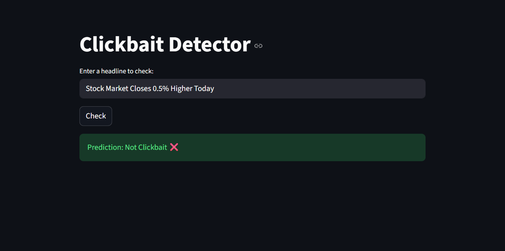

# Clickbait Detector
A machine learning project that detects whether a headline is **clickbait** or **not** using NLP and classification models.

---

## 📝 Overview

Clickbait headlines are designed to grab attention and get clicks, often exaggerating or misleading. This project uses **TF-IDF vectorization** and **Logistic Regression** to classify headlines accurately.  

**Accuracy:** ~95% on the test dataset.

---

## ⚡ Features

- Predicts whether a headline is clickbait or not.
- Simple web interface using **Streamlit**.
- Pretrained model saved for instant predictions.
- Lightweight and easy to run locally.

---
## 🖼️ Screenshot

Here’s how the Clickbait Detector app looks when running:



---

## 🛠️ Installation

1. Clone the repository:

```bash
git clone <your-repo-url>
cd Clickbait-Detector
````

2. Create a virtual environment:

```bash
python -m venv venv
```

3. Activate the environment:

* Windows:

```bash
.\venv\Scripts\activate
```

* Mac/Linux:

```bash
source venv/bin/activate
```

4. Install dependencies:

```bash
pip install -r requirements.txt
```

---

## 🚀 Usage

1. **Train the model (optional)**

```bash
python model.py
```

2. **Run the Streamlit app**

```bash
streamlit run app.py
```

3. **Open the URL** provided in the terminal (usually `http://localhost:8501`) and enter a headline to check.

---

## 🗂️ Project Structure

```
Clickbait-Detector/
│
├── data/                     # All datasets
│   └── clickbait.csv
│
├── images/                   # Screenshots or GIFs for README
│   └── image.png
│
├── models/                   # Saved models and vectorizers
│   ├── clickbait_model.pkl
│   └── vectorizer.pkl
│
├── src/                      # All Python scripts
│   ├── model.py              # Script to train and evaluate the model
│   └── app.py                # Streamlit web app
│
├── requirements.txt          # Python dependencies
├── README.md                 # Project description and instructions
└── .gitignore                # Files to ignore in Git

```

---

## 🧠 Technology Stack

* Python 3
* Pandas, NumPy
* Scikit-learn
* Streamlit
* Joblib (for saving/loading models)

---

## 📊 Model Performance

* **Accuracy:** 95%
* **Precision & Recall:** 0.95 for both clickbait and non-clickbait
* **F1-Score:** 0.95125

---

## ⚡ Future Improvements

* Try advanced models like **Naive Bayes**, **Random Forest**, or **XGBoost**.
* Add **word cloud analysis** and feature exploration.
* Deploy online using **HuggingFace Spaces**, **Render**, or **Heroku**.
* Add **multi-language support**.

---

## 📌 References

* [Clickbait Detection Dataset - Kaggle](https://www.kaggle.com/datasets/saurabhshahane/clickbait-detection-dataset)
* [Scikit-learn Documentation](https://scikit-learn.org/stable/)
* [Streamlit Documentation](https://docs.streamlit.io/)

---

